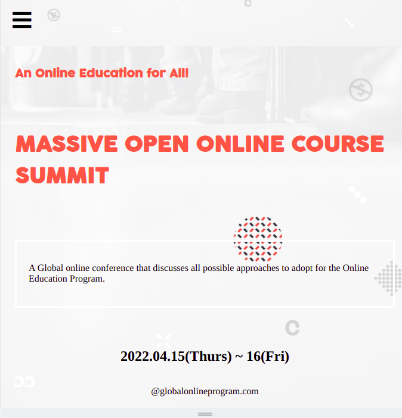

# MOOC-Capstone 

My first Capstone project for Web Development

# Capstone Project - Conference Page

> This is capstone project on which I used all basic HTML, CSS A\and JavaScript knowledge.

In this project, I worked created both Mobile and Desktop versions of my conference page.

## Built With

- HTML
- CSS (grid, flexbox)
- Visual Studio Code.
- JavaScript.
- Linters

## Live Demo

[link](https://moise-mulungu.github.io/MOOC-Capstone/)

## To watch this project presentation:
[link] (https://www.loom.com/share/5a03bf3735b4459db48f3c9eff7ce9b9)

## Author

👤 **Moise Mulungu**

- GitHub: [Moise Mulungu](https://github.com/moise-mulungu)
- Twitter: [Moise Mulungu](https://twitter.com/moise_mulungu)
- LinkedIn: [Moise Mulungu](https://www.linkedin.com/in/mo%C3%AFse-mulungu-a939831b2/)

## Design 

- Original design idea by [Cindy Shin in Behance](https://www.behance.net/adagio07) 
- [Design Guideline](https://www.behance.net/gallery/29845175/CC-Global-Summit-2015) 

## 🤝 Contributing

Contributions, issues, and feature requests are welcome!

Feel free to check the [issues page](https://github.com/moise-mulungu/MOOC-Capstone/issues).

## Show your support

Give a ⭐️ if you like this project!

## 📝 License

This project is [MIT](./MIT.md) licensed.